# Azure Administrator Workshop
Workshop for Azure Administrator

## Table of content
- [Azure Administrator Workshop](#azure-administrator-workshop)
  - [Table of content](#table-of-content)
    - [Starting With Azure](#starting-with-azure)
    - [Azure Compute Resources](#azure-compute-resources)
      - [Azure VM](#azure-vm)
      - [Azure Web App](#azure-web-app)
      - [The need of Containers](#the-need-of-containers)
        - [Azure Container Registry](#azure-container-registry)
        - [Azure Container Instances](#azure-container-instances)
        - [Container Groups in Azure Container Instances](#container-groups-in-azure-container-instances)
        - [Azure Kubernetes - AKS](#azure-kubernetes---aks)
        - [Azure Container Apps](#azure-container-apps)
      - [Azure Functions](#azure-functions)
    - [Manage and Configure Virtual Network](#manage-and-configure-virtual-network)
      - [Azure Virtual Network](#azure-virtual-network)
      - [Network Security Groups](#network-security-groups)
      - [Azure Load Balancer](#azure-load-balancer)
      - [Azure Application Gateway](#azure-application-gateway)
      - [Virtual Network Peering](#virtual-network-peering)
      - [VPN - Virtual Private Network](#vpn---virtual-private-network)
      - [Point-to-Site VPN Connection](#point-to-site-vpn-connection)
      - [Site to Site VPN Connection](#site-to-site-vpn-connection)
      - [Azure Virtual WAN](#azure-virtual-wan)
      - [Azure Express Route](#azure-express-route)
      - [Network Watcher Service](#network-watcher-service)
      - [User Defined Routes](#user-defined-routes)
      - [Azure Firewall](#azure-firewall)
        - [Azure Firewall Standard](#azure-firewall-standard)
        - [Azure Firewall Premium](#azure-firewall-premium)
        - [Azure Firewall Basic](#azure-firewall-basic)
      - [DNS - Domain Name System](#dns---domain-name-system)
        - [Local DNS](#local-dns)
        - [Azure Private DNS](#azure-private-dns)
        - [Azure Public DNS](#azure-public-dns)
      - [Be Private In Azure Environment](#be-private-in-azure-environment)
        - [Private endpoint](#private-endpoint)
        - [Vnet Integration](#vnet-integration)
    - [Manage Azure Storage](#manage-azure-storage)
      - [Azure Storage Accounts](#azure-storage-accounts)
    - [Manage Azure Identities and Governance](#manage-azure-identities-and-governance)
      - [Azure Subscriptions and Management levels of hierarchy](#azure-subscriptions-and-management-levels-of-hierarchy)
      - [Azure Active Directory](#azure-active-directory)
        - [Role Base Access Control](#role-base-access-control)
        - [Dynamic Groups](#dynamic-groups)
        - [Azure AD Roles](#azure-ad-roles)
        - [Self-service password reset](#self-service-password-reset)
        - [Multi-Factor Authentication](#multi-factor-authentication)
        - [Conditional Access Policies](#conditional-access-policies)
        - [Administrative Units](#administrative-units)
      - [Resource Tags](#resource-tags)
      - [Resouce Locks](#resouce-locks)
      - [Azure Policies](#azure-policies)
      - [Costing in Azure](#costing-in-azure)
      - [Azure Management Groups](#azure-management-groups)
    - [Monitor and Backup](#monitor-and-backup)
      - [Azure Monitor](#azure-monitor)
        - [Log Analytics Workspace](#log-analytics-workspace)
        - [Application Insights](#application-insights)
      - [Azure Backup](#azure-backup)
        - [Azure Backup for virtual machines](#azure-backup-for-virtual-machines)

### Starting With Azure

### Azure Compute Resources

#### Azure VM
 

- Check Usage + quotas for your Subscription 
- You can Ruquest Quota Increase 

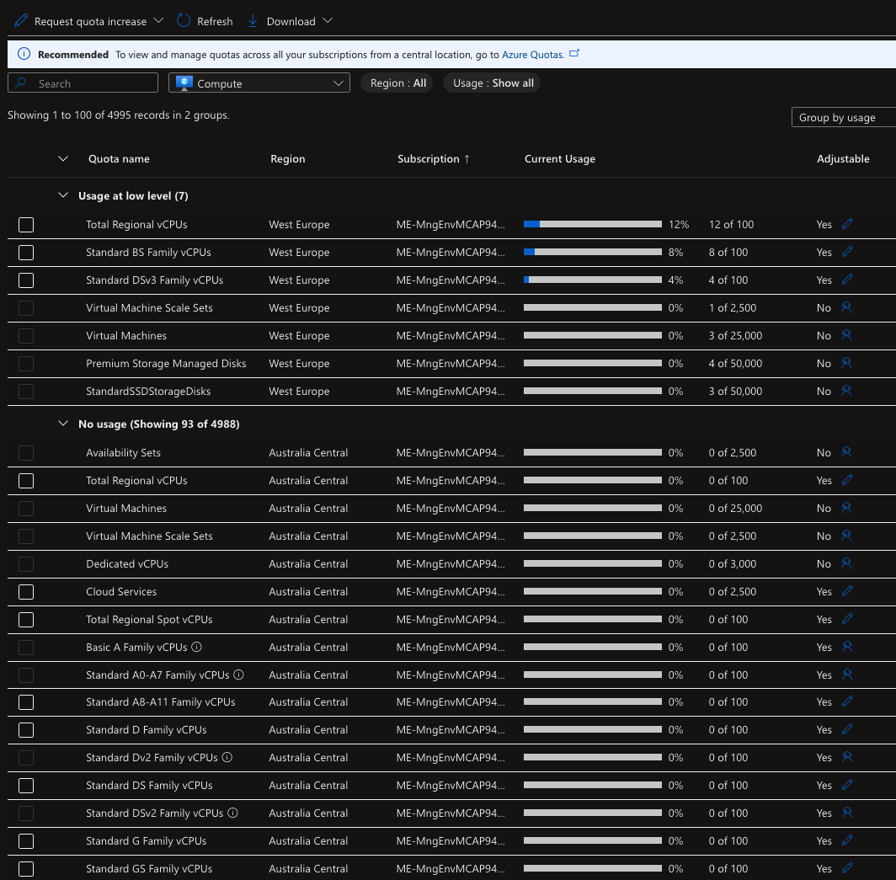

- Create a Budget alert in your Subscription Blade 
- Temporary Disk - Size varies depending on instance size
  - Data on the temporary disk is lost during a maintenance event
  - Data is lost when you redeploy the VM 
- Restart / Stopping the VM 
  - If you restart the VM, the public IP address will remain as it is. Also the data on the temporary disk remains as it is.
  - If you stop/deallocate the VM, the public IP address will be lost. The data on the temporary disk also gets erased.

- Azure Disk Types
  - Standard HDD - This is ideal for backup environments and non-critical workloads. Max disk size - 32,767 GiB, Max throughput - 500 MB/s , Max IOPS - 2000
  - Standard SSD - This is ideal for Web Servers and Dev/Test Environments. Max disk size - 32,767 GiB, Max throughput - 750 MB/s, Max IOPS - 6000
  - Premium SSD - This is ideal for Production environments. Max disk size - 32,767 GiB, Max throughput - 900 MB/s , Max IOPS - 20,000
  - Ultra Disk - This is ideal for IO Intensive workloads - SQL, Oracle databases. Max disk sizes - 65,536 GiB, Max throughput - 4000 MB/s, Max IOPS - 160,000

- Server-side Disk Encryption - Encrypted in data center 
  - Your data is automatically encrypted using 256-bit AES Encryption
    - PMK - Platform Managed Keys - Azure managed the keys
    - CMK - Customer Managed Keys - Managed by customer - need to store the key in key vault service and create a disk encryption set
  - This protects the data at rest
  - This is done for Managed disks - OS and data disks
- Azure Disk Encryption - helps protect and safeguard your data to meet your oranizational security and compliance commitments. ADE provides volume encryption for the OS and data disks of Azure virtual machines ( VMS ) through the use of feature DM-Crypt of Linux or BitLocker feature of Windows. ADE is integrated with Azure Key Vault to help you control and manage the disk encryption keys and secrets. 
- IOPS and Throughput 
  - IOPS - This setting defines the number of Input/Output operations per second - for dbs there will be a lot of read, write and update statements
  - Throughput - Amount of data that is being sent to the storage disk at a specified interval - Measured in MB per second 
- Data Disk Snapshot - Attach to new VM 
- Azure Share disks - This allows a managed disk to be attached to multiple vms
  - Can only be enable for Premium and Ultra disks
- Un-managed disks - For example Azure Blob Storage ( You can't have both managed and un-managed disks for a VM )
  - During the vm creation process you can disable managed disks and select your storage account  
  
- Custom Script Extension
  - This tool can be used on Azure Virtual Machines to download and execute scripts
  - This is ideal when you want to deploy any custom configration of any software installation on a virtual machine 
  - The scripts can be located in an Azure storage account or even in GitHub 
  - A time duration of 90 minutes is allowed for the script to run. Any longer and the result will be a failed extension provision
  - It's ideal not to place reboots inside the script, because the extension will not continue after the reboot. Hence if you have other commands that need to run via the extension after the reboot, they won't run
  - If your script does need a reboot, then maybe you can look at other tools such as Desired state configuration, Ansible or Chef or Puppet.
- Linux VMs - Cloud init 
  - During the linux vm creation process we can deploy an init script to install packages 
- Boot Diagnostic - Use this feature to troubleshoot failures for custom or platform images ( stores the data in azure storage accounts )
- Serial Console - Ability to log to vm console from azure portal
- Run command - Run scripts in your Windows VM by using managed Run Commands

- Azure Bastion 
  - Fully managed PaaS Service
  - Provides RDP/SSH connectivity to virtual machines from the Azure Portal via TLS
  - Connection via the Internet on port 443
  - The virtual machines deployed in seperate subnet - AzureBastionSubnet

- Availability Sets 
  - If you have two or more instances deployed in the same Availability Set, you will get an SLA of 99.99% for Virtual Machine Connectivity to at leaset one instance
  - Fault Domains - are used to define the group of virtual machines that share a common source and network switch. You can have up to 3 fault domains.
  - Update Domains -  are used to group virtual machines and physical hardware that can be rebooted at the same time. You can have up to 20 update domains.

- Availabity Zones 
  - Availability zones are unique physical locations that are equipped with independent power, cooling and networking, There are normally three availability zones in a region
  - If you have two or more instances deployed in two or more Availability Zone, you will get an SLA of 99.99% for Virtual Machine Connectivity to at least one instance
  - Each Availability zone is a unique physical location in an Azure region
  - Each zone comprises of one or more data centers that has independent power, cooling, and networking
  - Hence the physical separation of the Availability Zones helps protect applications against data center failures

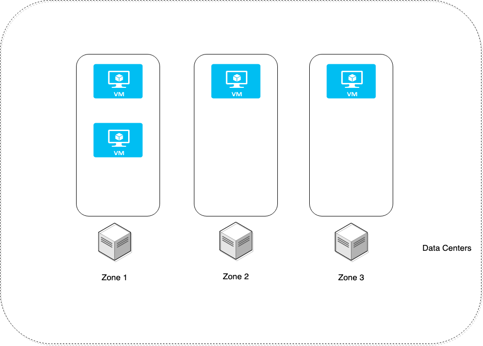

- Azure Virtual Machine scale sets
  - You define rules
  - The rule is based on a condition
  - Scale out - if the CPU percentage > 80% then add one machine
  - Scale In - if the CPU percentage < 70% then remove one machine 

- Images
  - Custom image with Application installed
  - This is a copy of the full VM which includes the data disks or just the OS disk 
  - You can create an image and place as part of an Azure compute gallery
  - You can share the Azure compute gallery across your organization so that other users can create VM's based on the images stored in the gallery 
  - You can create 2 image types:
    - Specialized VM Images - Here information about specific users and machine information is retained, New VM's created out of the image will have the same computer name and admin user information
    - Generalized VM Images - Here information about specific users and machine information is removed, Here you need to perform sysprep 

- Resize a VM
  -  Open the Azure Portal
  -  Open the page for the virtual machine 
  -  In the left menu, select Size 
  -  Pick a new size from the list of available sizes and then select Resize

- Proximity Placement groups
  - When you create multiple virtual machines or virtual machines that are part of a virtual machine scale set, these machines could be located in different data centers
  - Sometimes an application/system that uses multiple vms, want the vms to be located closer together to get least latency when it comes to communication between the virtual machines
  - By placing the vms as part of proximity group, the vms will be physically located close to each other
  - When using proximity placement groups, ensure the virtual machine have accelerated networking enabled. This also helps to improve network performance
  - When deploying vms from different families or SKU's, try to deploy them as part of a single template. This will increase the probability of ensuring all vms are deployed successfully
  - A proximity placement group is assigned to a data center when the first resource (VM) is being deployed and released once the resource is being deleted or stopped

#### Azure Web App 
Create and deploy mission-critical web applications that scale with your business  
- Platform as a service
  - You don't have to maintain the underlying compute infrastructure 
  - It has features such as Autoscaling and security 
  - It has DevOps cabalities which includes continuous deployment
  - We can add our custom domain 
  - We can add SSL to our web app 
  - We can use Azuer Web App Backups 
    - Stored in Azure storage account.
    - To use Backup and Restore feature, the App Service Plan needs to be in the Standard, Premium or Isolated tier.
    - Backup of the app + database can be up to maximum of 10GB 
  

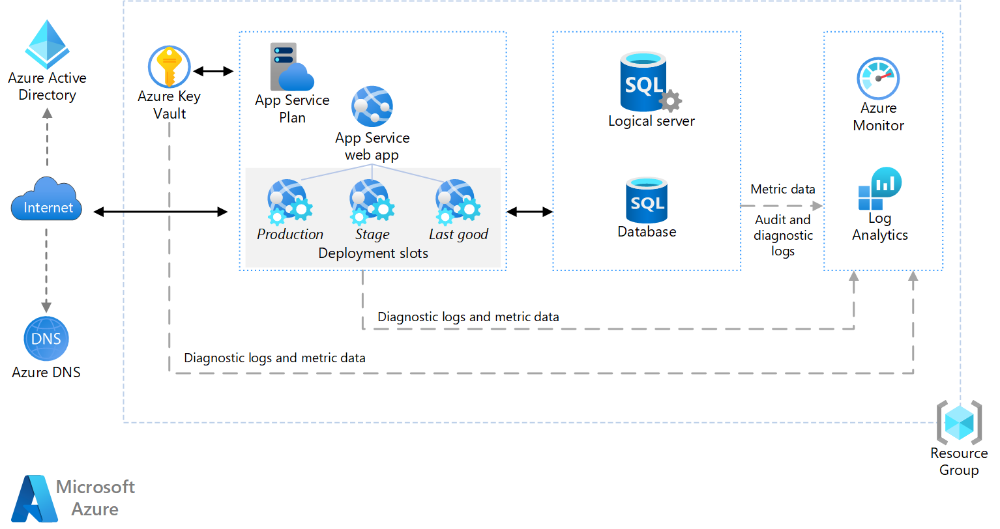

  - Azure WebApp - Vnet Integration
    - Need App Service Plan or higher
    - Allows the App service to access resources within the VNET
    - It does not allow private inbound access to your Web App from the virtual network 

#### The need of Containers

##### Azure Container Registry 
Build, store, secure, scan, replicate, and manage container images and artifacts with a fully managed, geo-replicated instance of OCI distribution. Connect across environments, including Azure Kubernetes Service and Azure Red Hat OpenShift, and across Azure services like App Service, Machine Learning, and Batch.

##### Azure Container Instances
Develop apps fast without managing virtual machines or having to learn new tools—it's just your application, in a container, running in the cloud.
- Run containers without managing servers
- Increase agility with containers on demand - Deploy containers to the cloud with unprecedented simplicity and speed—with a single command. Use ACI to provision additional compute for demanding workloads whenever you need. For example, with the Virtual Kubelet, use ACI to elastically burst from your Azure Kubernetes Service (AKS) cluster when traffic comes in spikes.
- Secure applications with hypervisor isolation - Gain the security of virtual machines for your container workloads, while preserving the efficiency of lightweight containers. ACI provides hypervisor isolation for each container group to ensure containers run in isolation without sharing a kernel.

##### Container Groups in Azure Container Instances
A container group is a collection of containers that get scheduled on the same host machine. The containers in a container group share a lifecycle, resources, local network, and storage volumes. It's similar in concept to a pod in Kubernetes.

The following diagram shows an example of a container group that includes multiple containers:

This example container group:  
- Is scheduled on a single host machine.
- Is assigned a DNS name label.
- Exposes a single public IP address, with one exposed port.
- Consists of two containers. One container listens on port 80, while the other listens on port 5000.
- Includes two Azure file shares as volume mounts, and each container mounts one of the shares locally.

**NOTE**  
Multi-container groups currently support only Linux containers. For Windows containers, Azure Container Instances only supports deployment of a single container instance. While we are working to bring all features to Windows containers, you can find current platform differences in the service Overview.

##### Azure Kubernetes - AKS
Managing containers at scale, Kubernetes is used to orchestate your containers for hosting your applications
Azure Kubernetes Service (AKS) offers the quickest way to start developing and deploying cloud-native apps in Azure, datacenters, or at the edge with built-in code-to-cloud pipelines and guardrails. Get unified management and governance for on-premises, edge, and multicloud Kubernetes clusters. Interoperate with Azure security, identity, cost management, and migration services.

- Automated management and scalability of Kubernetes clusters for enterprise-grade container orchestration
- End-to-end developer productivity with debugging, CI/CD, logging, and automated node maintenance
- Advanced identity and access management to monitor and maintain container security for governance at scale
- Support for Linux, Windows Server, and IoT resources with AKS deployment on the infrastructure of your choice using Azure Arc

- Managed Kubernetes handles the complexity for you 
  - Automated upgrades, patches
  - High reliability, availability 
  - Easy, secure cluster scalling 
  - Self-healing 
  - API server monitoring 
  - Control Plane - At not charge

- Multi-Layer Security 
  - Enforce compliance rules with Azure Policy 
  - Identity and access control using Azure Active Directory 
  - Encrypt using your own keys, stored in Azure Key Vault 
  - Gain unmatched security management with Azure Defender for Containers 
  - Interact securely with Kubernetes API server using Azure Private Link or Vnet Integration 

##### Azure Container Apps
Deploy containerized apps without managing complex infrastructure. Write code using your preferred programming language or framework, and build microservices with full support for Distributed Application Runtime (Dapr). Scale dynamically based on HTTP traffic or events powered by Kubernetes Event-Driven Autoscaling (KEDA).
- Support for a variety of application types, including HTTP APIs, microservices, event processing, and background tasks
- Flexibility to write code using your language, framework, or SDK of choice
- Robust autoscaling capabilities based on HTTP traffic or event triggers
- Simple configurations to perform modern application lifecycle tasks

Microservices with container apps:  

#### Azure Functions
Azure Functions is a serverless solution that allows you to write less code, maintain less infrastructure, and save on costs. Instead of worrying about deploying and maintaining servers, the cloud infrastructure provides all the up-to-date resources needed to keep your applications running.

You focus on the code that matters most to you, in the most productive language for you, and Azure Functions handles the rest.

- Scenarios 
  - Build a web API 
  - Process file uploads 
  - Build a serverless workflow
  - Respond to database changes
  - Run schedule tasks
  - Create reliable message queue systems
  - Analyze IoT data streams
  - Process data in real time 

**NOTE**  
[Serverless Functions reference architectures](https://learn.microsoft.com/en-us/azure/architecture/serverless-quest/reference-architectures)

  

### Manage and Configure Virtual Network

#### Azure Virtual Network 
Azure Virtual Network (VNet) is the fundamental building block for your private network in Azure. VNet enables many types of Azure resources, such as Azure Virtual Machines (VM), to securely communicate with each other, the internet, and on-premises networks. VNet is similar to a traditional network that you'd operate in your own data center, but brings with it additional benefits of Azure's infrastructure such as scale, availability, and isolation.

- Each VM in azure gets a virtual network interface with 
  - Private IP address
  - Public IP address ( optionally )

- Subnets
  - Logically group your network into sub networks 

- Static IP Address 
  - In case of Dynamic IP when your stop the Azure VM your public IP gonna be deallocated 
  - WebApp on VM use case with custom domain:
    
    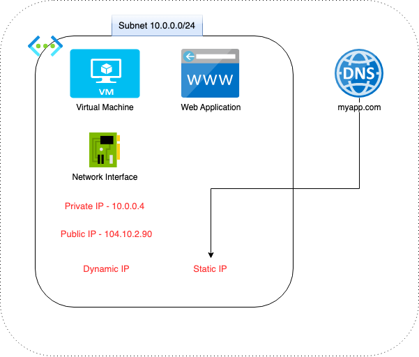
  
- Secondary network interface
  - Scenario - a firewall in hub subscription - one interface for internet communication and second one for internal communication
  - Security purposes

#### Network Security Groups 
You can use an Azure network security group to filter network traffic between Azure resources in an Azure virtual network. A network security group contains security rules that allow or deny inbound network traffic to, or outbound network traffic from, several types of Azure resources. For each rule, you can specify source and destination, port, and protocol.

- Basic type of security level
- Inbout rules / Outbound rules
  1. Priority 
  2. Port No
  3. Protocol
  4. Source and Destination 

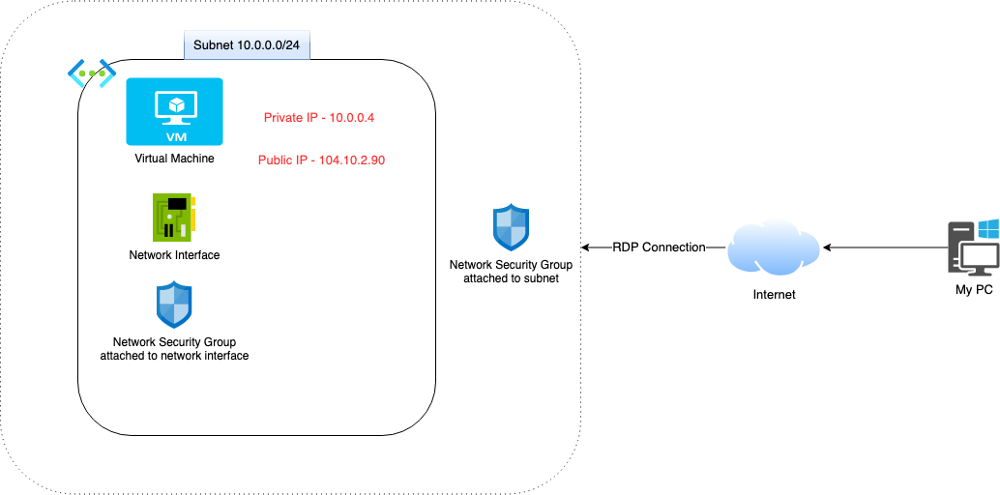

#### Azure Load Balancer 
Azure Load Balancer operates at layer 4 of the Open Systems Interconnection (OSI) model. It's the single point of contact for clients. Load balancer distributes inbound flows that arrive at the load balancer's front end to backend pool instances. These flows are according to configured load-balancing rules and health probes. The backend pool instances can be Azure Virtual Machines or instances in a Virtual Machine Scale Set.

- Basic Load Balancer
  - Free
  - The machines in the backend pool need to be a part of an availability set or scale set 
  - Health probes - TCP, HTTP
  - No support for availability zones
  - No SLA
  - Good for test purposes
- Standard Load Balancer
  - Charge per hour 
  - Here the machines can also be independent machines that are part of a virtual network 
  - Health probes - TCP, HTTP, HTTPS
  - Support for Availability Zones 
  - SLA of 99.99% 
  - Good for production purposes

- We can use a NAT rules on the load balancer 
- The load balancer will create an affinity between the Load Balancer and the client for a session 
  - Advantage - Can help in better performance for sessions 
  - Disadvantage - If too many sessions are persisted on a server 

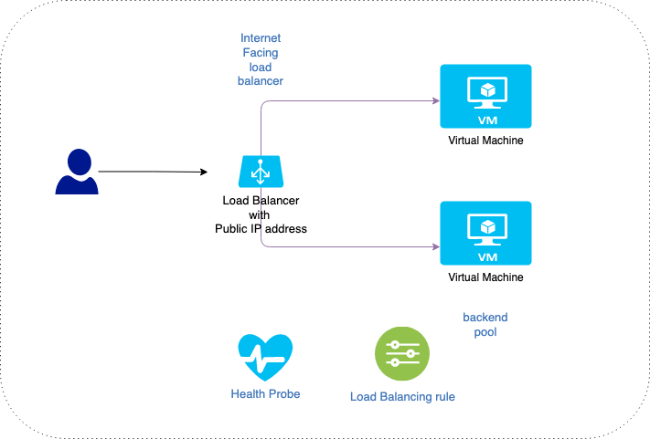

#### Azure Application Gateway 
Azure Application Gateway is a web traffic load balancer that enables you to manage traffic to your web applications. Traditional load balancers operate at the transport layer (OSI layer 4 - TCP and UDP) and route traffic based on source IP address and port, to a destination IP address and port.

Application Gateway can make routing decisions based on additional attributes of an HTTP request, for example URI path or host headers. For example, you can route traffic based on the incoming URL. So if /images is in the incoming URL, you can route traffic to a specific set of servers (known as a pool) configured for images. If /video is in the URL, that traffic is routed to another pool that's optimized for videos.
This type of routing is known as application layer (OSI layer 7) load balancing. Azure Application Gateway can do URL-based routing and more.

- Features 
  - Secure Sockets Layer (SSL/TLS) termination
  - Autoscaling - allows the Application Gateway to scale up or down based on traffic load patterns 
  - Static VIP
  - Web Application Firewall
  - Ingress Controller for AKS
  - URL-based routing 
  - Multiple-site hosting
  - Redirection
  - Session affinity 
  - Websocket and HTTP/2 traffic
  - Connection draining 
  - Custom error pages
  - Rewrite HTTP headers and URL

- How it works? 

1. Before a client sends a request to an application gateway, it resolves the domain name of the application gateway by using a Domain Name System (DNS) server. Azure controls the DNS entry because all application gateways are in the azure.com domain.

2. The Azure DNS returns the IP address to the client, which is the frontend IP address of the application gateway.

3. The application gateway accepts incoming traffic on one or more listeners. A listener is a logical entity that checks for connection requests. It's configured with a frontend IP address, protocol, and port number for connections from clients to the application gateway.

4. If a web application firewall (WAF) is in use, the application gateway checks the request headers and the body, if present, against WAF rules. This action determines if the request is valid request or a security threat. If the request is valid, it's routed to the backend. If the request isn't valid and WAF is in Prevention mode, it's blocked as a security threat. If it's in Detection mode, the request is evaluated and logged, but still forwarded to the backend server.

#### Virtual Network Peering 
Virtual network peering enables you to seamlessly connect two or more Virtual Networks in Azure. The virtual networks appear as one for connectivity purposes. The traffic between virtual machines in peered virtual networks uses the Microsoft backbone infrastructure. Like traffic between virtual machines in the same network, traffic is routed through Microsoft's private network only.

Azure supports the following types of peering:
- Virtual network peering: Connecting virtual networks within the same Azure region.
- Global virtual network peering: Connecting virtual networks across Azure regions.

The benefits of using virtual network peering, whether local or global, include:
- A low-latency, high-bandwidth connection between resources in different virtual networks.
- The ability for resources in one virtual network to communicate with resources in a different virtual network.
- The ability to transfer data between virtual networks across Azure subscriptions, Azure Active Directory tenants, deployment models, and Azure regions.
- The ability to peer virtual networks created through the Azure Resource Manager.
- The ability to peer a virtual network created through Resource Manager to one created through the classic deployment model. To learn more about Azure deployment models, see Understand Azure deployment models.
- No downtime to resources in either virtual network when creating the peering, or after the peering is created.

Gateways and on-premises connectivity: 

Each virtual network, including a peered virtual network, can have its own gateway. A virtual network can use its gateway to connect to an on-premises network. You can also configure virtual network-to-virtual network connections by using gateways, even for peered virtual networks.

When you configure both options for virtual network interconnectivity, the traffic between the virtual networks flows through the peering configuration. The traffic uses the Azure backbone.

You can also configure the gateway in the peered virtual network as a transit point to an on-premises network. In this case, the virtual network that is using a remote gateway can't have its own gateway. A virtual network could have only one gateway, the gateway should be either local or remote gateway in the peered virtual network as shown in the following diagram:

- Virtual Network Peering is used to connect two Azure virtual networks together via the backbone network.
- Azure supports connecting two virtual networks located in the same region or networks located across regions.
- Once you enable virtual network peering between two virtual networks, the virtual machines can then communicate via their private IP addresses across the peering connection.
- You can also peer virtual networks that are located across different subscriptions.
- The virtual networks can't have overlapping CIDR blocks.

#### VPN - Virtual Private Network 
Azure Virtual Network (VNet) is the fundamental building block for your private network in Azure. VNet enables many types of Azure resources, such as Azure Virtual Machines (VM), to securely communicate with each other, the internet, and on-premises networks. VNet is similar to a traditional network that you'd operate in your own data center, but brings with it additional benefits of Azure's infrastructure such as scale, availability, and isolation.

- Your Internet Services provider will know all of the requests that are made from your machine onto the internet 
- Sometimes privacy can always be a concern 
- VPN is used to create a private network 
- Here your public IP address is not placed in the requests that are made onto the Internet 
- Also VPN connections are encrypted so that the data transfer is more secure

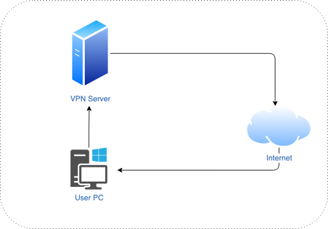

#### Point-to-Site VPN Connection
A Point-to-Site (P2S) VPN gateway connection lets you create a secure connection to your virtual network from an individual client computer. A P2S connection is established by starting it from the client computer. This solution is useful for telecommuters who want to connect to Azure VNets from a remote location, such as from home or a conference. P2S VPN is also a useful solution to use instead of S2S VPN when you have only a few clients that need to connect to a VNet. This article applies to the Resource Manager deployment model.

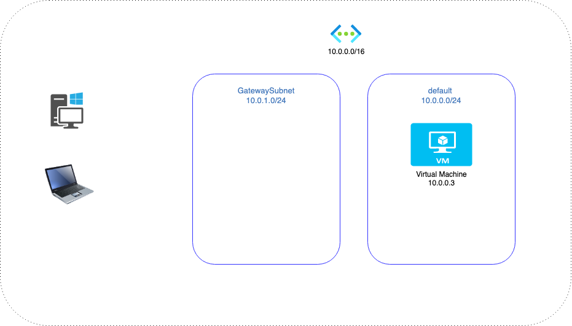

- The gateway subnet is used to host gateway VM's and services
- The VM's in the gateway subnet are configured with the required VPN gateway settings 
- No other VM's must be deployed to the gateway subnet
- The gateway subnet can be configured as /29, but Microsoft recommends /27, /26 address ranges 
- We can have only 1 gatewaySubnet for each vnet 
- We can establish connection via certificates
- Generate certificates for point 2 site using powershell - [click here](https://learn.microsoft.com/en-us/azure/vpn-gateway/vpn-gateway-certificates-point-to-site)

#### Site to Site VPN Connection
A Site-to-Site VPN gateway connection is used to connect your on-premises network to an Azure virtual network over an IPsec/IKE (IKEv1 or IKEv2) VPN tunnel. This type of connection requires a VPN device located on-premises that has an externally facing public IP address assigned to it.

- Create a virtual network
- Create a VPN gateway
- Create a local network gateway
- Create a VPN Connection
- Verify the connection
- Connect to a virtual machine 

- Tutorial: Create a site-to-site VPN connection in the Azure portal - [click here](https://learn.microsoft.com/en-us/azure/vpn-gateway/tutorial-site-to-site-portal)

- On the on-premise side, you need to have a VPN device that can route traffic via the Internet onto the VPN gateway in Azure. The VPN device can be a hardware device like a Cisco router or a software device ( e.g Windows Server 2016 running Routing and Remote services). The VPN device needs to have a publically routable IP address.
- The subnets in your on-premise network must not overlap with the subnets in your Azure virtual network
- The Site-to-Site VPN connection uses an IPSec tunnel to encrypt the traffic
- The VPN gateway resource you create in Azure is used to route encrypted traffic between your on-premise data center and your Azure virtual network
- There are different SKU's for the Azure VPN gateway service. Each SKU has a different pricing and attributes associated with it - Reference - [click here](https://docs.microsoft.com/en-us/azure/vpn-gateway/vpn-gateway-about-vpn-gateway-settings)

#### Azure Virtual WAN 
Azure Virtual WAN is a networking service that brings many networking, security, and routing functionalities together to provide a single operational interface. Some of the main features include:
- Branch connectivity (via connectivity automation from Virtual WAN Partner devices such as SD-WAN or VPN CPE).
- Site-to-site VPN connectivity.
- Remote user VPN connectivity (point-to-site).
- Private connectivity (ExpressRoute).
- Intra-cloud connectivity (transitive connectivity for virtual networks).
- VPN ExpressRoute inter-connectivity.
- Routing, Azure Firewall, and encryption for private connectivity.

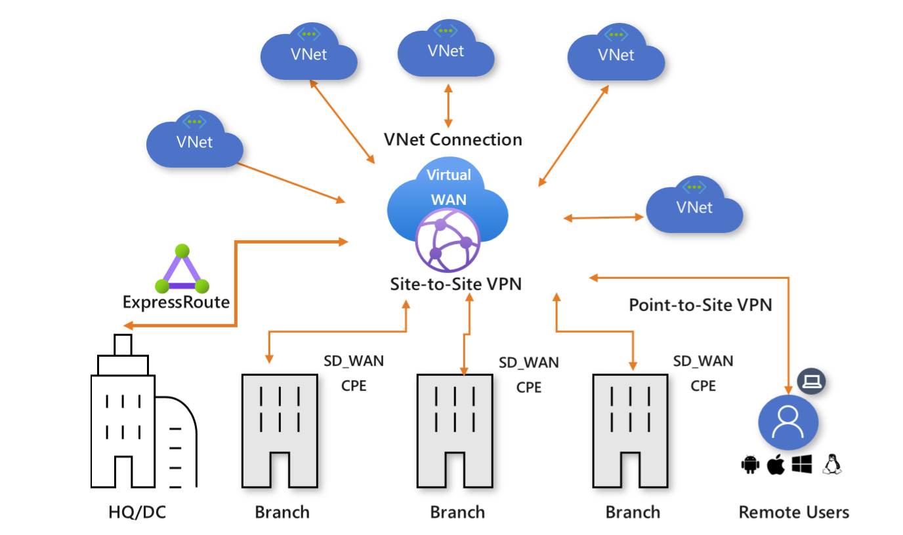

#### Azure Express Route 
ExpressRoute lets you extend your on-premises networks into the Microsoft cloud over a private connection with the help of a connectivity provider. With ExpressRoute, you can establish connections to Microsoft cloud services, such as Microsoft Azure and Microsoft 365.

Connectivity can be from an any-to-any (IP VPN) network, a point-to-point Ethernet network, or a virtual cross-connection through a connectivity provider at a colocation facility. ExpressRoute connections don't go over the public Internet. This allows ExpressRoute connections to offer more reliability, faster speeds, consistent latencies, and higher security than typical connections over the Internet. For information on how to connect your network to Microsoft using ExpressRoute, see ExpressRoute connectivity models.

Key Benefits:  
- Layer 3 connectivity between your on-premises network and the Microsoft Cloud through a connectivity provider. Connectivity can be from an any-to-any (IPVPN) network, a point-to-point Ethernet connection, or through a virtual cross-connection via an Ethernet exchange.
- Connectivity to Microsoft cloud services across all regions in the geopolitical region.
- Global connectivity to Microsoft services across all regions with the ExpressRoute premium add-on.
- Dynamic routing between your network and Microsoft via BGP.
- Built-in redundancy in every peering location for higher reliability.
- Connection uptime SLA.
- QoS support for Skype for Business.

#### Network Watcher Service 
- **Connection Monitor** - Check the network connectivity between machines. These can be in Azure or on your on-premises environments
- **Next Hop** - Here you can see the next route for a packet of data. This helps you understand whether the packet is being routed to the correct destination
- **IP Flow Verify** - This can be used to check if a packet is allowed or denied to or from a virtual machine. If a packet is being denied by a securiry group, you can see which rule is denying the packet 
- **Connection troubleshoot** - Check the connection from a virtual machine to a virtual machine, fully qualified domain name, URI or IPv4 address
- **NSG Diagnostic** - Provides detailed information that helps to understand and debug the security configuration of the network 
- **Traffic Analytics** - This helps to log information about the IP traffic that is flowing through an NSG
- **NSG Flow Logs** - Helps to provide visibility into user and application activity in cloud networks

#### User Defined Routes 
Azure routes traffic between all subnets within a virtual network, by default. You can create your own routes to override Azure's default routing. Custom routes are helpful when, for example, you want to route traffic between subnets through a network virtual appliance (NVA).  

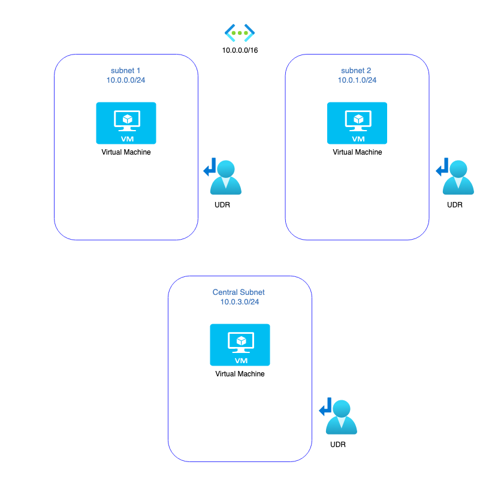

#### Azure Firewall
Azure Firewall is a cloud-native and intelligent network firewall security service that provides the best of breed threat protection for your cloud workloads running in Azure. It's a fully stateful, firewall as a service with built-in high availability and unrestricted cloud scalability. It provides both east-west and north-south traffic inspection.

Azure Firewall is offered in three SKUs: Standard, Premium, and Basic.

- Has built-in high availability
- Can deploy the Azure Firewall Instance across two or more Availability Zones - 99.99% SLA
- You can filter traffic based on fully-qualified domain names
- You can also create network filtering rules - Based on source and destination IP address, port and protocol 
- It is a stateful in nature, so it understands what packets of data to allow 
- It has built-in Intelligence - Here you can get alerts or deny traffic from/to malicious IP addresses and domains

##### Azure Firewall Standard 

##### Azure Firewall Premium 

##### Azure Firewall Basic 

#### DNS - Domain Name System
##### Local DNS 
1. Install Active Directory Domain Services
2. Promote the server to a domain controller
3. Specify a root domain name - mtcisrael.com
4. Create a new server as part of a new subnet
5. Install Internet Information Services on the server
6. Use Azure provided DNS names
7. Now its time to use our DNS Server 
   1. For the network, we need to mention our DNS server
   2. Restart our servers
   3. Add a record to the zone 

##### Azure Private DNS
The Domain Name System, or DNS, is responsible for translating (or resolving) a service name to an IP address. Azure DNS is a hosting service for domains and provides naming resolution using the Microsoft Azure infrastructure. Azure DNS not only supports internet-facing DNS domains, but it also supports private DNS zones.

Azure Private DNS provides a reliable and secure DNS service for your virtual network. Azure Private DNS manages and resolves domain names in the virtual network without the need to configure a custom DNS solution. By using private DNS zones, you can use your own custom domain name instead of the Azure-provided names during deployment. Using a custom domain name helps you tailor your virtual network architecture to best suit your organization's needs. It provides a naming resolution for virtual machines (VMs) within a virtual network and connected virtual networks. Additionally, you can configure zones names with a split-horizon view, which allows a private and a public DNS zone to share the name.

To resolve the records of a private DNS zone from your virtual network, you must link the virtual network with the zone. Linked virtual networks have full access and can resolve all DNS records published in the private zone. You can also enable autoregistration on a virtual network link. When you enable autoregistration on a virtual network link, the DNS records for the virtual machines in that virtual network are registered in the private zone. When autoregistration gets enabled, Azure DNS will update the zone record whenever a virtual machine gets created, changes its' IP address, or gets deleted.

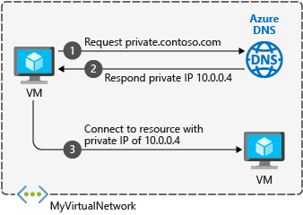

##### Azure Public DNS
A DNS zone is used to host the DNS records for a particular domain. To start hosting your domain in Azure DNS, you need to create a DNS zone for that domain name. Each DNS record for your domain is then created inside this DNS zone.

For example, the domain 'contoso.com' may contain several DNS records, such as 'mail.contoso.com' (for a mail server) and 'www.contoso.com' (for a web site).

When creating a DNS zone in Azure DNS:
- The name of the zone must be unique within the resource group, and the zone must not exist already. Otherwise, the operation fails.
- The same zone name can be reused in a different resource group or a different Azure subscription.
- Where multiple zones share the same name, each instance is assigned different name server addresses. Only one set of addresses can be configured with the domain name registrar.

#### Be Private In Azure Environment 

##### Private endpoint
A private endpoint is a network interface that uses a private IP address from your virtual network. This network interface connects you privately and securely to a service that's powered by Azure Private Link. By enabling a private endpoint, you're bringing the service into your virtual network.

The service could be an Azure service such as: 
- Azure Storage
- Azure Cosmos DB
- Azure SQL Database
- You own service, using Private Link Service

Private endpoints enable connectivity between the customers from the same:

- Virtual network
- Regionally peered virtual networks
- Globally peered virtual networks
- On-premises environments that use VPN or Express Route
- Services that are powered by Private Link

Protect Azure services against data exfiltration:

Get access from on-premises and peered networks:

Simplify the way you consume services on Azure:

##### Vnet Integration
Virtual network integration gives your app access to resources in your virtual network, but it doesn't grant inbound private access to your app from the virtual network. Private site access refers to making an app accessible only from a private network, such as from within an Azure virtual network. Virtual network integration is used only to make outbound calls from your app into your virtual network. Refer to private endpoint for inbound private access.

The virtual network integration feature:
- Requires a supported Basic or Standard, Premium, Premium v2, Premium v3, or Elastic Premium App Service pricing tier.
- Supports TCP and UDP.
- Works with App Service apps, function apps and Logic apps.

Virtual network integration supports connecting to a virtual network in the same region. Using virtual network integration enables your app to access:
- Resources in the virtual network you're integrated with.
- Resources in virtual networks peered to the virtual network your app is integrated with including global peering connections.
- Resources across Azure ExpressRoute connections.
- Service endpoint-secured services.
- Private endpoint-enabled services.

When you use virtual network integration, you can use the following Azure networking features:
- Network security groups (NSGs): You can block outbound traffic with an NSG that's placed on your integration subnet. The inbound rules don't apply because you can't use virtual network integration to provide inbound access to your app.
- Route tables (UDRs): You can place a route table on the integration subnet to send outbound traffic where you want.
- NAT gateway: You can use NAT gateway to get a dedicated outbound IP and mitigate SNAT port exhaustion.

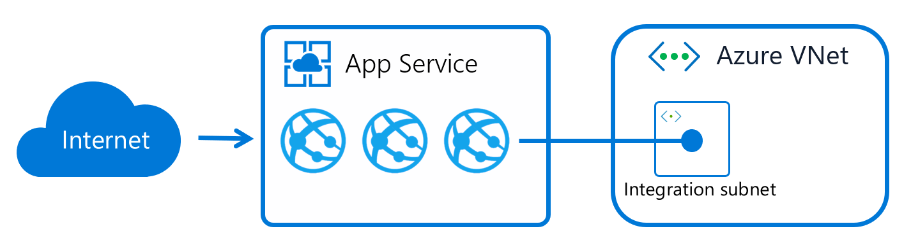

--- 

### Manage Azure Storage

#### Azure Storage Accounts
An Azure storage account contains all of your Azure Storage data objects, including blobs, file shares, queues, tables, and disks. The storage account provides a unique namespace for your Azure Storage data that's accessible from anywhere in the world over HTTP or HTTPS. Data in your storage account is durable and highly available, secure, and massively scalable.

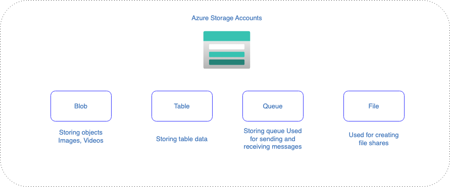

Types of storage accounts:  

| Type of storage account | Supported storage services | Redundancy options | Usage  |
| ----------------------- |--------------------------- | ------------------ | ------ |
| Standard general-purpose v2 | Blob Storage ( including Data Lake Storage ), Queue Storage, Table Storage, and Azure Files | Locally redundant storage (LRS) / geo-redundant storage (GRS) / read-access geo-redundant storage (RA-GRS) Zone-redundant storage (ZRS) / geo-zone-redundant storage (GZRS) / read-access geo-zone-redundant storage (RA-GZRS) | Standard storage account type for blobs, file shares, queues, and tables. Recommended for most scenarios using Azure Storage. If you want support for network file system (NFS) in Azure Files, use the premium file shares account type. | 
| Premium block blobs | Blob Storage (including Data Lake Storage ) | LRS ZRS | Premium storage account type for block blobs and append blobs. Recommended for scenarios with high transaction rates or that use smaller objects or require consistently low storage latency. Learn more about example workloads. | 
| Premium file shares | Azure Files | LRS | Premium storage account type for page blobs only. |

- Access Tiers 
  - Hot Access Tier - This is used for data that is accessed frequently 
  - Cool Access Tier - This is used for data that is accessed infrequently and stored for at least 30 days 
  - Archive Access Tier - This is used for data that is rarely accessed and stored for at least 180 days 

- Lifecycle policies 
  - Lifecycle Management rules 
  - Change the access tier 
  - Delete an object 

- Lifecycle Management 
  - Transition - Here you can transition blobs from the cool to the hot access tier to save on storage costs
  - Blobs - You can transition blobs, blob versions and blob snapshots
  - Deletion - You can also define rules to delete blobs, blob versions and blob snapshots
  - Rule filters - You can define filter for blobTypes - blockBlob, appendBlob
  - Rule actions - You have actions such as tierToCool, tierToArchive and delete
  - Support - Rules are supported for blob and append blobs in General-Purpose V2 accounts, Premium Blobk Blob and Blob Storage accounts
  - Region - This feature is available in all regions

- Object Replication
  - This feature can be used to copy blobs between a source and destination storage account
  - You can create rules to specify which objects get replicated from the source to the destination
  - Storage Account support - General Purpose V2 and Premium Blob accounts
  - Blob versioning should be enabled on both the source and destination storage account 
  - Change feed is enabled on the source storage account 

- Azure File Share
  
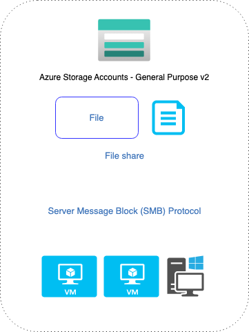

- Azure File Sync 
  - Use Azure File Sync to centralize your organization's file shares in Azure Files, while keeping the flexibility, performance, and compatibility of an on-premises file server. Azure File Sync transforms Windows Server into a quick cache of your Azure file share. You can use any protocol that's available on Windows Server to access your data locally, including SMB, NFS, and FTPS. You can have as many caches as you need across the world.

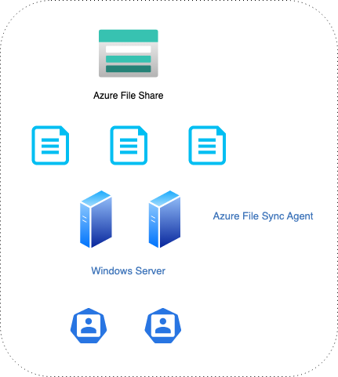

- Azure Import/Export Service
  - Copying Data - This is used for copying large amounts of data to Azure Blob storage and Azure Files
  - Transfer Data - You can also transfer data from Azure Blob storage to your on-premises environment
  - Disk Drives - Here you make use of Disk Drives. You can use your own Disk drives or use the ones provided by Microsoft
  - Jobs - You basically create a job via the Azure Portal. This will be used for transferring data to a storage account 
  - Data Box  
    - Data transfer - Helps to send terabytes of data in and out of Azure
    - No Internet - You don't need to use your Internet connection to transfer the data
    - Scenario - Ideal when you want to transfer data sizes that are larger than 40TB
    - Device - You order the Data Box device via the Azure Portal 
  - AzCopy Tool - AzCopy is a command-line utility that you can use to copy blobs or files to or from a storage account - [Click Here](https://learn.microsoft.com/en-us/azure/storage/common/storage-use-azcopy-v10) to get started

---

### Manage Azure Identities and Governance

#### Azure Subscriptions and Management levels of hierarchy 
Microsoft provides a hierarchy of organizations, subscriptions, licenses, and user accounts for consistent use of identities and billing across its cloud offerings:
- Microsoft 365 and Microsoft Office 365
- Microsoft Azure
- Microsoft Dynamics 365

- Management levels and hierarchy
  - **Management Groups**  - help you manage access, policy, and compliance for multiple subscriptions. All subscriptions in a management group automatically inherit the conditions that are applied to the management group
  - **Subscriptions** - logically associate user accounts with the resources that they create. Each subscription has limits or quotas on the amount of resources that it can create and use. Organizations can use subscriptions to manage costs and the resources that are created by users, teams, and projects
  - **Resource groups** - are logical containers where you can deploy and manage Azure resources like web apps, databases, and storage accounts
  - **Resources** - are instances of services that you can create, such as virtual machines, storage, and SQL databases 

- Payment models 
  - Pay as you go - Pay for what you use - Highest
  - Enterprise agreement - 3 Years - Substantial discounts available but only for high volumes
  - Cloud Service Provider (CSP) - You can purchase e.g. licenses for Office 365, Dynamics 365, Enterprise Mobility Suite, Power BI - Discounts or value-added services available

#### Azure Active Directory 
Azure Active Directory (Azure AD) is a cloud-based identity and access management service. Azure AD enables your employees access external resources, such as Microsoft 365, the Azure portal, and thousands of other SaaS applications. Azure Active Directory also helps them access internal resources like apps on your corporate intranet, and any cloud apps developed for your own organization

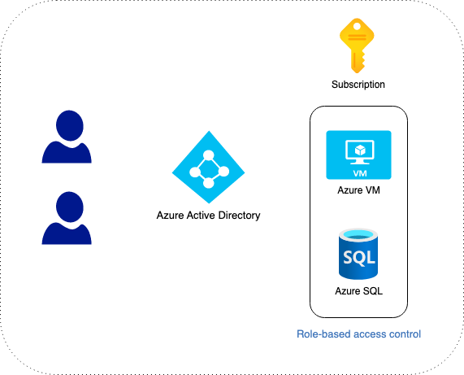

Licenses:
- Premium P1 - Included with Microsoft 365 - 6$ user/month
- Premium P2 - Included with Microsoft 365 - 9$ user/month
- Free - Included with Microsoft 365
- Office 365 apps - Included with Microsoft 365

Trust between Azure Subscription and Azure AD
- Azure Tenant - This is a dedicated and trusted instance of Azure AD
- Azure AD Directory - Each Azure tenant has a dedicated and trusted Azure AD directory, This includes the tenant's users, groups and applications and us used for performing identity and access management onto resources

##### Role Base Access Control 
- **Contributor** - Grants full access to manage all resources, but does not allow you to assign roles in Azure RBAC, manage assignments in Azure Blueprints, or share image galleries.	
- **Owner** - Grants full access to manage all resources, including the ability to assign roles in Azure RBAC.	
- **Reader** - View all resources, but does not allow you to make any changes.
- **User Access Administrator** - Lets you manage user access to Azure resources.	
- **Full List** - [click here](https://learn.microsoft.com/en-us/azure/role-based-access-control/built-in-roles)
- **Custom Roles** - We can create a custom role based on existing roles 

##### Dynamic Groups 
You can create attribute-based rules to enable dynamic membership for a group in Azure Active Directory (Azure AD), part of Microsoft Entra. Dynamic group membership adds and removes group members automatically using membership rules based on member attributes. This article details the properties and syntax to create dynamic membership rules for users or devices. You can set up a rule for dynamic membership on security groups or Microsoft 365 groups.

When the attributes of a user or a device change, the system evaluates all dynamic group rules in a directory to see if the change would trigger any group adds or removes. If a user or device satisfies a rule on a group, they're added as a member of that group. If they no longer satisfy the rule, they're removed. You can't manually add or remove a member of a dynamic group.

- You can create a dynamic group for devices or for users, but you can't create a rule that contains both users and devices.
- You can't create a device group based on the user attributes of the device owner. Device membership rules can reference only device attributes.

##### Azure AD Roles
Azure AD role-based access control manages access to Azure AD resources. Create custom roles, assign roles that use administrative units to restrict scope of control, assign application access to groups or users, manage eligibility with Privileged Identity Management (PIM), or delegate permissions to distribute identity management tasks.

There are about 60 Azure Active Directory (Azure AD) built-in roles, which are roles with a fixed set of role permissions. To supplement the built-in roles, Azure AD also supports custom roles. Use custom roles to select the role permissions that you want. For example, you could create one to manage particular Azure AD resources such as applications or service principals.

- Ability to create users 
- Ability to manage passwords
- etc..

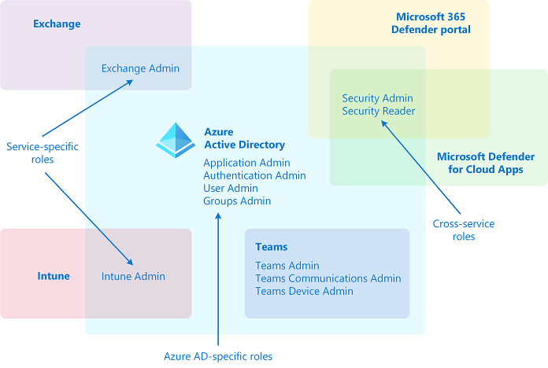

##### Self-service password reset 
This feature helps users to reset their password without the need of contacting the IT help desk staff 

- License - Password reset needs Azure AD Premium P1 or P2 license for users 
- Password writeback - If there is a hybrid environment, the changed passwords can be written back to the on-premises Active Directory 
- Authentication Methods - You can define authentication methods to reset the password
- Number of methods - Define the number of authentication methods required to reset the password
- Number of days - Number of days before users need to reconfirm their authentication information
- Notification - Notify users when password is reset 

##### Multi-Factor Authentication
Use strong multifactor authentication (MFA) in Azure Active Directory (Azure AD) to help protect your organization against breaches due to lost or stolen credentials.
- Use stronger security than passwords alone 
- Protect your users from credential theft 
- Secure your resource against unathorized access 
- Ensure a seamless user experience 

##### Conditional Access Policies 
The modern security perimeter now extends beyond an organization's network to include user and device identity. Organizations can use identity-driven signals as part of their access control decisions.
Conditional Access brings signals together, to make decisions, and enforce organizational policies. Azure AD Conditional Access is at the heart of the new identity-driven control plane.

     
       
Common signals that Conditional Access can take in to account when making a policy decision include the following signals:
- User or group membership
  - Policies can be targeted to specific users and groups giving administrators fine-grained control over access.
- IP Location information
  - Organizations can create trusted IP address ranges that can be used when making policy decisions.
  - Administrators can specify entire countries/regions IP ranges to block or allow traffic from.
- Device
  - Users with devices of specific platforms or marked with a specific state can be used when enforcing Conditional Access policies.
  - Use filters for devices to target policies to specific devices like privileged access workstations.
- Application
  - Users attempting to access specific applications can trigger different Conditional Access policies.
- Real-time and calculated risk detection
  - Signals integration with Azure AD Identity Protection allows Conditional Access policies to identify risky sign-in behavior. Policies can then force users to change their password, do multi-factor authentication to reduce their risk level, or block access until an administrator takes manual action.
- Microsoft Defender for Cloud Apps
  - Enables user application access and sessions to be monitored and controlled in real time, increasing visibility and control over access to and activities done within your cloud environment.

##### Administrative Units
Administrative units restrict permissions in a role to any portion of your organization that you define. You could, for example, use administrative units to delegate the Helpdesk Administrator role to regional support specialists, so they can manage users only in the region that they support.

Users can be members of multiple administrative units. For example, you might add users to administrative units by geography and division; Megan Bowen might be in the "Seattle" and "Marketing" administrative units.

  

Documentation - [click here](https://learn.microsoft.com/en-us/azure/active-directory/roles/administrative-units)

#### Resource Tags 
ags are metadata elements that you apply to your Azure resources. They're key-value pairs that help you identify resources based on settings that are relevant to your organization. If you want to track the deployment environment for your resources, add a key named Environment. To identify the resources deployed to production, give them a value of Production. Fully formed, the key-value pair becomes, Environment = Production.

You can apply tags to your Azure resources, resource groups, and subscriptions.

#### Resouce Locks 
Locking resources can help ensure user's dont accidently delete or modify resource.
There is 2 types of locks:
- **CanNotDelete** - authorized users can still read and modify resource, but they can't delete the resource.
- **ReadOnly** - authorized users can read a resource, but they can't delete or update the resource

#### Azure Policies 
Azure Policy helps to enforce organizational standards and to assess compliance at-scale. Through its compliance dashboard, it provides an aggregated view to evaluate the overall state of the environment, with the ability to drill down to the per-resource, per-policy granularity. It also helps to bring your resources to compliance through bulk remediation for existing resources and automatic remediation for new resources.

Common use cases for Azure Policy include implementing governance for resource consistency, regulatory compliance, security, cost, and management. Policy definitions for these common use cases are already available in your Azure environment as built-ins to help you get started.

Specifically, some useful governance actions you can enforce with Azure Policy include:
- Ensuring your team deploys Azure resources only to allowed regions
- Enforcing the consistent application of taxonomic tags
- Requiring resources to send diagnostic logs to a Log Analytics workspace

#### Costing in Azure
- Azure has many ways to tackle costs
- Cost analysis as part of your subscription
  - Here you can see the current spending 
  - See spending per resource
  - See your forecasts
  - See you spending history 
  - See the spending based on tags, resource types etc
- Azure Advisor 

#### Azure Management Groups 
If your organization has many Azure subscriptions, you may need a way to efficiently manage access, policies, and compliance for those subscriptions. Management groups provide a governance scope above subscriptions. You organize subscriptions into management groups; the governance conditions you apply cascade by inheritance to all associated subscriptions.

Management groups give you enterprise-grade management at scale no matter what type of subscriptions you might have. However, all subscriptions within a single management group must trust the same Azure Active Directory (Azure AD) tenant.

For example, you can apply policies to a management group that limits the regions available for virtual machine (VM) creation. This policy would be applied to all nested management groups, subscriptions, and resources, and allow VM creation only in authorized regions.

--- 

### Monitor and Backup 

#### Azure Monitor
Azure Monitor helps you maximize the availability and performance of your applications and services. It delivers a comprehensive solution for collecting, analyzing, and acting on telemetry from your cloud and on-premises environments. This information helps you understand how your applications are performing and proactively identify issues that affect them and the resources they depend on.

A few examples of what you can do with Azure Monitor include:
- Detect and diagnose issues across applications and dependencies with Application Insights.
- Correlate infrastructure issues with VM insights and Container insights.
- Drill into your monitoring data with Log Analytics for troubleshooting and deep diagnostics.
- Support operations at scale with automated actions.
- Create visualizations with Azure dashboards and workbooks.
- Collect data from monitored resources by using Azure Monitor Metrics.
- Investigate change data for routine monitoring or for triaging incidents by using Change Analysis.

Overview:

- Metrics for Azure resources
  - CPU Usage
  - Disk Metricts
  - Network Stats
  - Alerts
- Activity Logs 
  - Control Plane activities 
  - When a virtual machine is stopped 
  - When a virtual machine is created 
- Log Analytics Workspace 
  - Central Solution for all of your logs 
- Application Insights
  - Performance 
  - Management system for your live applications

##### Log Analytics Workspace 
A Log Analytics workspace is a unique environment for log data from Azure Monitor and other Azure services, such as Microsoft Sentinel and Microsoft Defender for Cloud. Each workspace has its own data repository and configuration but might combine data from multiple services. This article provides an overview of concepts related to Log Analytics workspaces and provides links to other documentation for more details on each.
based on Kusto query language 

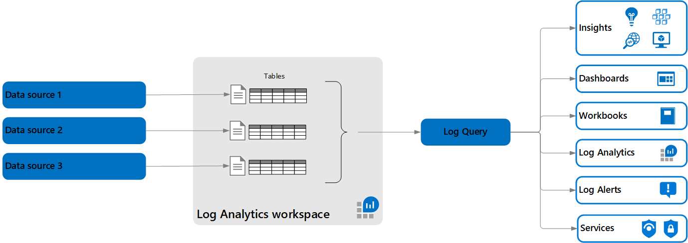

##### Application Insights 
Application Insights is an extension of Azure Monitor and provides Application Performance Monitoring (also known as “APM”) features. APM tools are useful to monitor applications from development, through test, and into production in the following ways:

1. Proactively understand how an application is performing.
2. Reactively review application execution data to determine the cause of an incident.

#### Azure Backup 
The Azure Backup service provides simple, secure, and cost-effective solutions to back up your data and recover it from the Microsoft Azure cloud.

What can I back up? 
- On-premises - Back up files, folders, system state using the Microsoft Azure Recovery Services (MARS) agent. Or use the DPM or Azure Backup Server (MABS) agent to protect on-premises VMs(Hyper-V and VMware) and other on-premises workloads
- Azure VMs - Back up entire Windows/Linux VMs (using backup extensions) or back up files, folders, and system state using the MARS agent.
- Azure Managed Disks - Back up Azure Managed Disks
- Azure Files shares - Back up Azure File shares to a storage account
- SQL Server in Azure VMs - Back up SQL Server databases running on Azure VMs
- SAP HANA databases in Azure VMs - Backup SAP HANA databases running on Azure VMs
- Azure Database for PostgreSQL servers - Back up Azure PostgreSQL databases and retain the backups for up to 10 years
- Azure Blobs - Overview of operational backup for Azure Blobs

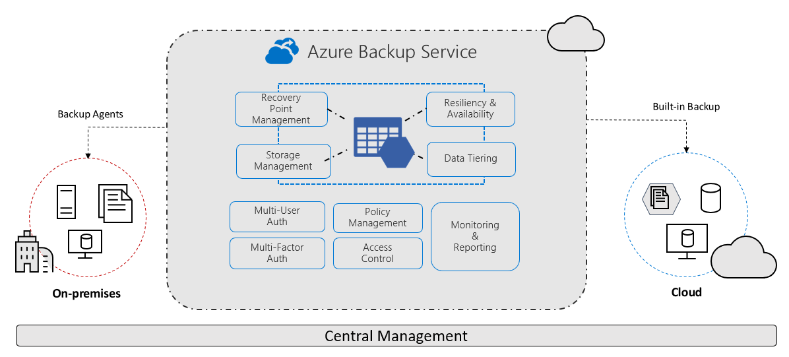

How Azure Backup protects from ransomware?  
Azure Backup helps protect your critical business systems and backup data against a ransomware attack by implementing preventive measures and providing tools that protect your organization from every step that attackers take to infiltrate your systems. It provides security to your backup environment, both when your data is in transit and at rest.

##### Azure Backup for virtual machines 
- Provides access to data on the VM of something happens to the original VM 
- The backup gets written to a Recovery Service Vault 