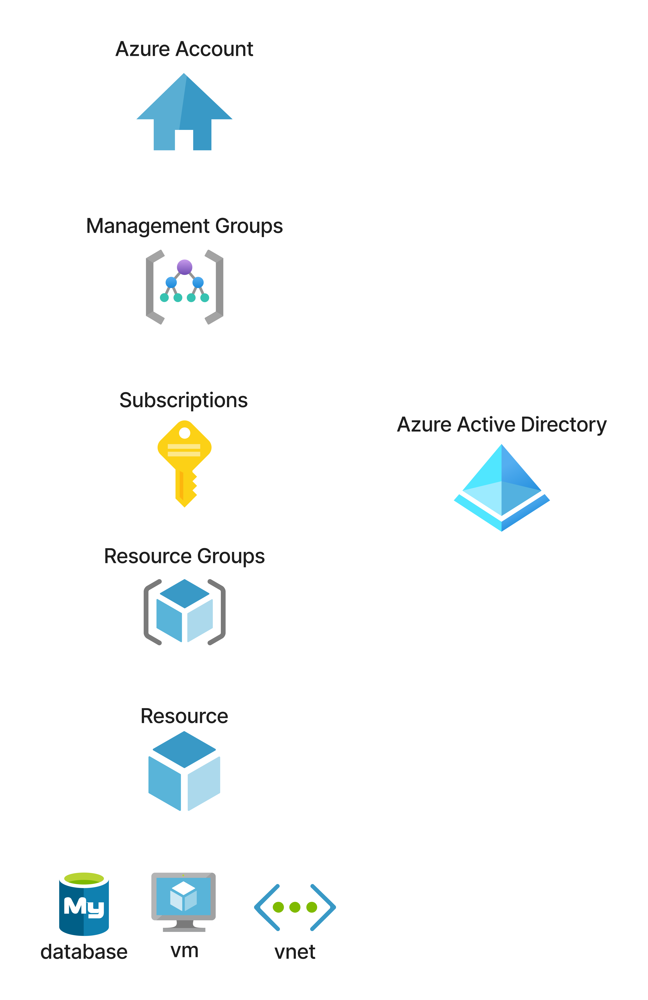
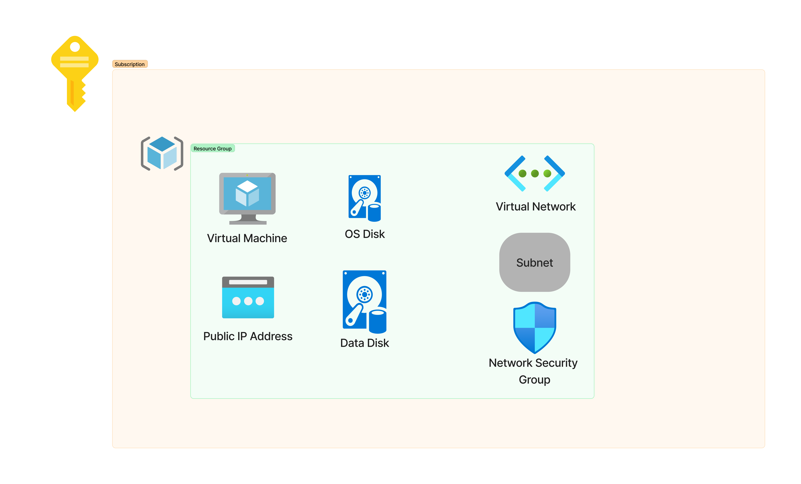
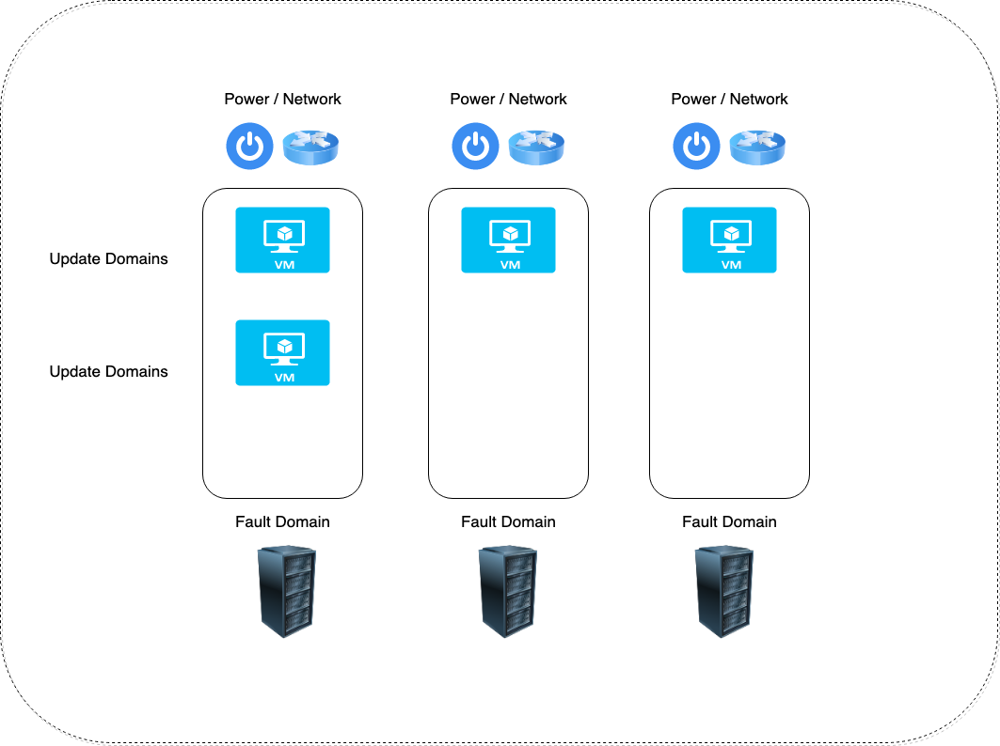
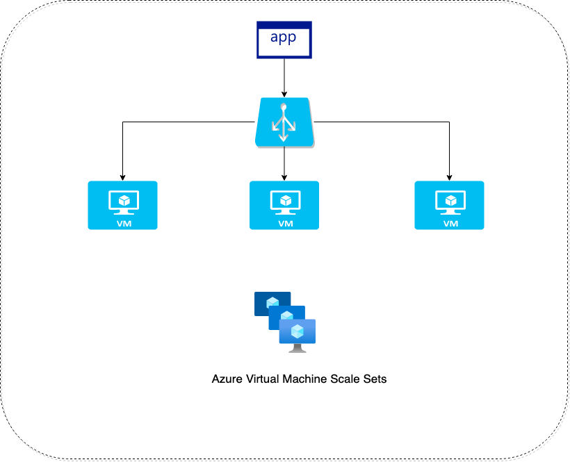
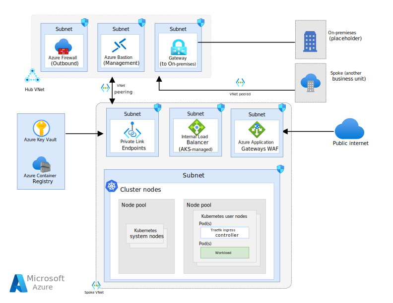
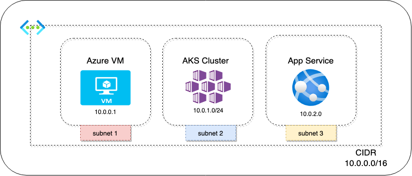
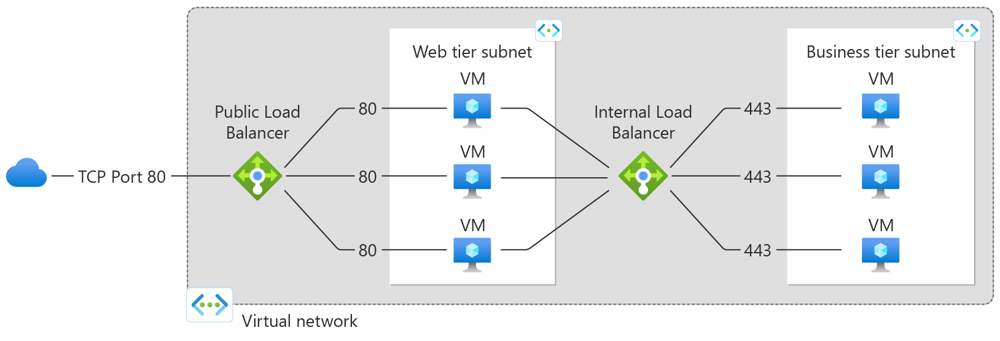
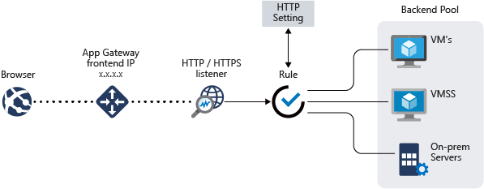

# Azure Administrator Workshop
Workshop for Azure Administrator

## Table of content
- [Azure Administrator Workshop](#azure-administrator-workshop)
  - [Table of content](#table-of-content)
    - [Starting With Azure](#starting-with-azure)
    - [Azure Compute Resources](#azure-compute-resources)
      - [Azure VM](#azure-vm)
      - [Azure Web App](#azure-web-app)
      - [The need of Containers](#the-need-of-containers)
        - [Azure Container Registry](#azure-container-registry)
        - [Azure Container Instances](#azure-container-instances)
        - [Container Groups in Azure Container Instances](#container-groups-in-azure-container-instances)
        - [Azure Kubernetes - AKS](#azure-kubernetes---aks)
        - [Azure Container Apps](#azure-container-apps)
      - [Azure Functions](#azure-functions)
    - [Manage and Configure Virtual Network](#manage-and-configure-virtual-network)
      - [Azure Virtual Network](#azure-virtual-network)
      - [Network Security Groups](#network-security-groups)
      - [Azure Load Balancer](#azure-load-balancer)
      - [Azure Application Gateway](#azure-application-gateway)
      - [Virtual Network Peering](#virtual-network-peering)
      - [VPN - Virtual Private Network](#vpn---virtual-private-network)
        - [Point-to-Site VPN Connection](#point-to-site-vpn-connection)
    - [Manage Azure Storage](#manage-azure-storage)
    - [Monitor and Backup](#monitor-and-backup)
    - [Manage Azure Identities and Governance](#manage-azure-identities-and-governance)

### Starting With Azure

### Azure Compute Resources

#### Azure VM
 

- Check Usage + quotas for your Subscription 
- You can Ruquest Quota Increase 

- Create a Budget alert in your Subscription Blade 
- Temporary Disk - Size varies depending on instance size
  - Data on the temporary disk is lost during a maintenance event
  - Data is lost when you redeploy the VM 
- Restart / Stopping the VM 
  - If you restart the VM, the public IP address will remain as it is. Also the data on the temporary disk remains as it is.
  - If you stop/deallocate the VM, the public IP address will be lost. The data on the temporary disk also gets erased.

- Azure Disk Types
  - Standard HDD - This is ideal for backup environments and non-critical workloads. Max disk size - 32,767 GiB, Max throughput - 500 MB/s , Max IOPS - 2000
  - Standard SSD - This is ideal for Web Servers and Dev/Test Environments. Max disk size - 32,767 GiB, Max throughput - 750 MB/s, Max IOPS - 6000
  - Premium SSD - This is ideal for Production environments. Max disk size - 32,767 GiB, Max throughput - 900 MB/s , Max IOPS - 20,000
  - Ultra Disk - This is ideal for IO Intensive workloads - SQL, Oracle databases. Max disk sizes - 65,536 GiB, Max throughput - 4000 MB/s, Max IOPS - 160,000

- Server-side Disk Encryption - Encrypted in data center 
  - Your data is automatically encrypted using 256-bit AES Encryption
    - PMK - Platform Managed Keys - Azure managed the keys
    - CMK - Customer Managed Keys - Managed by customer - need to store the key in key vault service and create a disk encryption set
  - This protects the data at rest
  - This is done for Managed disks - OS and data disks
- Azure Disk Encryption - helps protect and safeguard your data to meet your oranizational security and compliance commitments. ADE provides volume encryption for the OS and data disks of Azure virtual machines ( VMS ) through the use of feature DM-Crypt of Linux or BitLocker feature of Windows. ADE is integrated with Azure Key Vault to help you control and manage the disk encryption keys and secrets. 
- IOPS and Throughput 
  - IOPS - This setting defines the number of Input/Output operations per second - for dbs there will be a lot of read, write and update statements
  - Throughput - Amount of data that is being sent to the storage disk at a specified interval - Measured in MB per second 
- Data Disk Snapshot - Attach to new VM 
- Azure Share disks - This allows a managed disk to be attached to multiple vms
  - Can only be enable for Premium and Ultra disks
- Un-managed disks - For example Azure Blob Storage ( You can't have both managed and un-managed disks for a VM )
  - During the vm creation process you can disable managed disks and select your storage account  
  
- Custom Script Extension
  - This tool can be used on Azure Virtual Machines to download and execute scripts
  - This is ideal when you want to deploy any custom configration of any software installation on a virtual machine 
  - The scripts can be located in an Azure storage account or even in GitHub 
  - A time duration of 90 minutes is allowed for the script to run. Any longer and the result will be a failed extension provision
  - It's ideal not to place reboots inside the script, because the extension will not continue after the reboot. Hence if you have other commands that need to run via the extension after the reboot, they won't run
  - If your script does need a reboot, then maybe you can look at other tools such as Desired state configuration, Ansible or Chef or Puppet.
- Linux VMs - Cloud init 
  - During the linux vm creation process we can deploy an init script to install packages 
- Boot Diagnostic - Use this feature to troubleshoot failures for custom or platform images ( stores the data in azure storage accounts )
- Serial Console - Ability to log to vm console from azure portal
- Run command - Run scripts in your Windows VM by using managed Run Commands

- Azure Bastion 
  - Fully managed PaaS Service
  - Provides RDP/SSH connectivity to virtual machines from the Azure Portal via TLS
  - Connection via the Internet on port 443
  - The virtual machines deployed in seperate subnet - AzureBastionSubnet

- Availability Sets 
  - If you have two or more instances deployed in the same Availability Set, you will get an SLA of 99.99% for Virtual Machine Connectivity to at leaset one instance
  - Fault Domains - are used to define the group of virtual machines that share a common source and network switch. You can have up to 3 fault domains.
  - Update Domains -  are used to group virtual machines and physical hardware that can be rebooted at the same time. You can have up to 20 update domains.

- Availabity Zones 
  - Availability zones are unique physical locations that are equipped with independent power, cooling and networking, There are normally three availability zones in a region
  - If you have two or more instances deployed in two or more Availability Zone, you will get an SLA of 99.99% for Virtual Machine Connectivity to at least one instance
  - Each Availability zone is a unique physical location in an Azure region
  - Each zone comprises of one or more data centers that has independent power, cooling, and networking
  - Hence the physical separation of the Availability Zones helps protect applications against data center failures

- Azure Virtual Machine scale sets
  - You define rules
  - The rule is based on a condition
  - Scale out - if the CPU percentage > 80% then add one machine
  - Scale In - if the CPU percentage < 70% then remove one machine 

- Images
  - Custom image with Application installed
  - This is a copy of the full VM which includes the data disks or just the OS disk 
  - You can create an image and place as part of an Azure compute gallery
  - You can share the Azure compute gallery across your organization so that other users can create VM's based on the images stored in the gallery 
  - You can create 2 image types:
    - Specialized VM Images - Here information about specific users and machine information is retained, New VM's created out of the image will have the same computer name and admin user information
    - Generalized VM Images - Here information about specific users and machine information is removed, Here you need to perform sysprep 

- Resize a VM
  -  Open the Azure Portal
  -  Open the page for the virtual machine 
  -  In the left menu, select Size 
  -  Pick a new size from the list of available sizes and then select Resize

- Proximity Placement groups
  - When you create multiple virtual machines or virtual machines that are part of a virtual machine scale set, these machines could be located in different data centers
  - Sometimes an application/system that uses multiple vms, want the vms to be located closer together to get least latency when it comes to communication between the virtual machines
  - By placing the vms as part of proximity group, the vms will be physically located close to each other
  - When using proximity placement groups, ensure the virtual machine have accelerated networking enabled. This also helps to improve network performance
  - When deploying vms from different families or SKU's, try to deploy them as part of a single template. This will increase the probability of ensuring all vms are deployed successfully
  - A proximity placement group is assigned to a data center when the first resource (VM) is being deployed and released once the resource is being deleted or stopped

#### Azure Web App 
Create and deploy mission-critical web applications that scale with your business  
- Platform as a service
  - You don't have to maintain the underlying compute infrastructure 
  - It has features such as Autoscaling and security 
  - It has DevOps cabalities which includes continuous deployment
  - We can add our custom domain 
  - We can add SSL to our web app 
  - We can use Azuer Web App Backups 
    - Stored in Azure storage account.
    - To use Backup and Restore feature, the App Service Plan needs to be in the Standard, Premium or Isolated tier.
    - Backup of the app + database can be up to maximum of 10GB 
  

  - Azure WebApp - Vnet Integration
    - Need App Service Plan or higher
    - Allows the App service to access resources within the VNET
    - It does not allow private inbound access to your Web App from the virtual network 

#### The need of Containers

##### Azure Container Registry 
Build, store, secure, scan, replicate, and manage container images and artifacts with a fully managed, geo-replicated instance of OCI distribution. Connect across environments, including Azure Kubernetes Service and Azure Red Hat OpenShift, and across Azure services like App Service, Machine Learning, and Batch.

##### Azure Container Instances
Develop apps fast without managing virtual machines or having to learn new tools—it's just your application, in a container, running in the cloud.
- Run containers without managing servers
- Increase agility with containers on demand - Deploy containers to the cloud with unprecedented simplicity and speed—with a single command. Use ACI to provision additional compute for demanding workloads whenever you need. For example, with the Virtual Kubelet, use ACI to elastically burst from your Azure Kubernetes Service (AKS) cluster when traffic comes in spikes.
- Secure applications with hypervisor isolation - Gain the security of virtual machines for your container workloads, while preserving the efficiency of lightweight containers. ACI provides hypervisor isolation for each container group to ensure containers run in isolation without sharing a kernel.

##### Container Groups in Azure Container Instances
A container group is a collection of containers that get scheduled on the same host machine. The containers in a container group share a lifecycle, resources, local network, and storage volumes. It's similar in concept to a pod in Kubernetes.

The following diagram shows an example of a container group that includes multiple containers:

This example container group:  
- Is scheduled on a single host machine.
- Is assigned a DNS name label.
- Exposes a single public IP address, with one exposed port.
- Consists of two containers. One container listens on port 80, while the other listens on port 5000.
- Includes two Azure file shares as volume mounts, and each container mounts one of the shares locally.

**NOTE**  
Multi-container groups currently support only Linux containers. For Windows containers, Azure Container Instances only supports deployment of a single container instance. While we are working to bring all features to Windows containers, you can find current platform differences in the service Overview.

##### Azure Kubernetes - AKS
Managing containers at scale, Kubernetes is used to orchestate your containers for hosting your applications
Azure Kubernetes Service (AKS) offers the quickest way to start developing and deploying cloud-native apps in Azure, datacenters, or at the edge with built-in code-to-cloud pipelines and guardrails. Get unified management and governance for on-premises, edge, and multicloud Kubernetes clusters. Interoperate with Azure security, identity, cost management, and migration services.

- Automated management and scalability of Kubernetes clusters for enterprise-grade container orchestration
- End-to-end developer productivity with debugging, CI/CD, logging, and automated node maintenance
- Advanced identity and access management to monitor and maintain container security for governance at scale
- Support for Linux, Windows Server, and IoT resources with AKS deployment on the infrastructure of your choice using Azure Arc

- Managed Kubernetes handles the complexity for you 
  - Automated upgrades, patches
  - High reliability, availability 
  - Easy, secure cluster scalling 
  - Self-healing 
  - API server monitoring 
  - Control Plane - At not charge

- Multi-Layer Security 
  - Enforce compliance rules with Azure Policy 
  - Identity and access control using Azure Active Directory 
  - Encrypt using your own keys, stored in Azure Key Vault 
  - Gain unmatched security management with Azure Defender for Containers 
  - Interact securely with Kubernetes API server using Azure Private Link or Vnet Integration 

##### Azure Container Apps
Deploy containerized apps without managing complex infrastructure. Write code using your preferred programming language or framework, and build microservices with full support for Distributed Application Runtime (Dapr). Scale dynamically based on HTTP traffic or events powered by Kubernetes Event-Driven Autoscaling (KEDA).
- Support for a variety of application types, including HTTP APIs, microservices, event processing, and background tasks
- Flexibility to write code using your language, framework, or SDK of choice
- Robust autoscaling capabilities based on HTTP traffic or event triggers
- Simple configurations to perform modern application lifecycle tasks

Microservices with container apps:  

#### Azure Functions
Azure Functions is a serverless solution that allows you to write less code, maintain less infrastructure, and save on costs. Instead of worrying about deploying and maintaining servers, the cloud infrastructure provides all the up-to-date resources needed to keep your applications running.

You focus on the code that matters most to you, in the most productive language for you, and Azure Functions handles the rest.

- Scenarios 
  - Build a web API 
  - Process file uploads 
  - Build a serverless workflow
  - Respond to database changes
  - Run schedule tasks
  - Create reliable message queue systems
  - Analyze IoT data streams
  - Process data in real time 

**NOTE**  
[Serverless Functions reference architectures](https://learn.microsoft.com/en-us/azure/architecture/serverless-quest/reference-architectures)

  

### Manage and Configure Virtual Network

#### Azure Virtual Network 
Azure Virtual Network (VNet) is the fundamental building block for your private network in Azure. VNet enables many types of Azure resources, such as Azure Virtual Machines (VM), to securely communicate with each other, the internet, and on-premises networks. VNet is similar to a traditional network that you'd operate in your own data center, but brings with it additional benefits of Azure's infrastructure such as scale, availability, and isolation.

- Each VM in azure gets a virtual network interface with 
  - Private IP address
  - Public IP address ( optionally )

- Subnets
  - Logically group your network into sub networks 

- Static IP Address 
  - In case of Dynamic IP when your stop the Azure VM your public IP gonna be deallocated 
  - WebApp on VM use case with custom domain:
    
    
  
- Secondary network interface
  - Scenario - a firewall in hub subscription - one interface for internet communication and second one for internal communication
  - Security purposes

#### Network Security Groups 
You can use an Azure network security group to filter network traffic between Azure resources in an Azure virtual network. A network security group contains security rules that allow or deny inbound network traffic to, or outbound network traffic from, several types of Azure resources. For each rule, you can specify source and destination, port, and protocol.

- Basic type of security level
- Inbout rules / Outbound rules
  1. Priority 
  2. Port No
  3. Protocol
  4. Source and Destination 

#### Azure Load Balancer 
Azure Load Balancer operates at layer 4 of the Open Systems Interconnection (OSI) model. It's the single point of contact for clients. Load balancer distributes inbound flows that arrive at the load balancer's front end to backend pool instances. These flows are according to configured load-balancing rules and health probes. The backend pool instances can be Azure Virtual Machines or instances in a Virtual Machine Scale Set.

- Basic Load Balancer
  - Free
  - The machines in the backend pool need to be a part of an availability set or scale set 
  - Health probes - TCP, HTTP
  - No support for availability zones
  - No SLA
  - Good for test purposes
- Standard Load Balancer
  - Charge per hour 
  - Here the machines can also be independent machines that are part of a virtual network 
  - Health probes - TCP, HTTP, HTTPS
  - Support for Availability Zones 
  - SLA of 99.99% 
  - Good for production purposes

- We can use a NAT rules on the load balancer 
- The load balancer will create an affinity between the Load Balancer and the client for a session 
  - Advantage - Can help in better performance for sessions 
  - Disadvantage - If too many sessions are persisted on a server 

#### Azure Application Gateway 
Azure Application Gateway is a web traffic load balancer that enables you to manage traffic to your web applications. Traditional load balancers operate at the transport layer (OSI layer 4 - TCP and UDP) and route traffic based on source IP address and port, to a destination IP address and port.

Application Gateway can make routing decisions based on additional attributes of an HTTP request, for example URI path or host headers. For example, you can route traffic based on the incoming URL. So if /images is in the incoming URL, you can route traffic to a specific set of servers (known as a pool) configured for images. If /video is in the URL, that traffic is routed to another pool that's optimized for videos.
This type of routing is known as application layer (OSI layer 7) load balancing. Azure Application Gateway can do URL-based routing and more.

- Features 
  - Secure Sockets Layer (SSL/TLS) termination
  - Autoscaling - allows the Application Gateway to scale up or down based on traffic load patterns 
  - Static VIP
  - Web Application Firewall
  - Ingress Controller for AKS
  - URL-based routing 
  - Multiple-site hosting
  - Redirection
  - Session affinity 
  - Websocket and HTTP/2 traffic
  - Connection draining 
  - Custom error pages
  - Rewrite HTTP headers and URL

- How it works? 

1. Before a client sends a request to an application gateway, it resolves the domain name of the application gateway by using a Domain Name System (DNS) server. Azure controls the DNS entry because all application gateways are in the azure.com domain.

2. The Azure DNS returns the IP address to the client, which is the frontend IP address of the application gateway.

3. The application gateway accepts incoming traffic on one or more listeners. A listener is a logical entity that checks for connection requests. It's configured with a frontend IP address, protocol, and port number for connections from clients to the application gateway.

4. If a web application firewall (WAF) is in use, the application gateway checks the request headers and the body, if present, against WAF rules. This action determines if the request is valid request or a security threat. If the request is valid, it's routed to the backend. If the request isn't valid and WAF is in Prevention mode, it's blocked as a security threat. If it's in Detection mode, the request is evaluated and logged, but still forwarded to the backend server.

#### Virtual Network Peering 
Virtual network peering enables you to seamlessly connect two or more Virtual Networks in Azure. The virtual networks appear as one for connectivity purposes. The traffic between virtual machines in peered virtual networks uses the Microsoft backbone infrastructure. Like traffic between virtual machines in the same network, traffic is routed through Microsoft's private network only.

Azure supports the following types of peering:
- Virtual network peering: Connecting virtual networks within the same Azure region.
- Global virtual network peering: Connecting virtual networks across Azure regions.

The benefits of using virtual network peering, whether local or global, include:
- A low-latency, high-bandwidth connection between resources in different virtual networks.
- The ability for resources in one virtual network to communicate with resources in a different virtual network.
- The ability to transfer data between virtual networks across Azure subscriptions, Azure Active Directory tenants, deployment models, and Azure regions.
- The ability to peer virtual networks created through the Azure Resource Manager.
- The ability to peer a virtual network created through Resource Manager to one created through the classic deployment model. To learn more about Azure deployment models, see Understand Azure deployment models.
- No downtime to resources in either virtual network when creating the peering, or after the peering is created.

Gateways and on-premises connectivity: 

Each virtual network, including a peered virtual network, can have its own gateway. A virtual network can use its gateway to connect to an on-premises network. You can also configure virtual network-to-virtual network connections by using gateways, even for peered virtual networks.

When you configure both options for virtual network interconnectivity, the traffic between the virtual networks flows through the peering configuration. The traffic uses the Azure backbone.

You can also configure the gateway in the peered virtual network as a transit point to an on-premises network. In this case, the virtual network that is using a remote gateway can't have its own gateway. A virtual network could have only one gateway, the gateway should be either local or remote gateway in the peered virtual network as shown in the following diagram:

- Virtual Network Peering is used to connect two Azure virtual networks together via the backbone network.
- Azure supports connecting two virtual networks located in the same region or networks located across regions.
- Once you enable virtual network peering between two virtual networks, the virtual machines can then communicate via their private IP addresses across the peering connection.
- You can also peer virtual networks that are located across different subscriptions.
- The virtual networks can't have overlapping CIDR blocks.

#### VPN - Virtual Private Network 
Azure Virtual Network (VNet) is the fundamental building block for your private network in Azure. VNet enables many types of Azure resources, such as Azure Virtual Machines (VM), to securely communicate with each other, the internet, and on-premises networks. VNet is similar to a traditional network that you'd operate in your own data center, but brings with it additional benefits of Azure's infrastructure such as scale, availability, and isolation.

- Your Internet Services provider will know all of the requests that are made from your machine onto the internet 
- Sometimes privacy can always be a concern 
- VPN is used to create a private network 
- Here your public IP address is not placed in the requests that are made onto the Internet 
- Also VPN connections are encrypted so that the data transfer is more secure

##### Point-to-Site VPN Connection
A Point-to-Site (P2S) VPN gateway connection lets you create a secure connection to your virtual network from an individual client computer. A P2S connection is established by starting it from the client computer. This solution is useful for telecommuters who want to connect to Azure VNets from a remote location, such as from home or a conference. P2S VPN is also a useful solution to use instead of S2S VPN when you have only a few clients that need to connect to a VNet. This article applies to the Resource Manager deployment model.

- The gateway subnet is used to host gateway VM's and services
- The VM's in the gateway subnet are configured with the required VPN gateway settings 
  

### Manage Azure Storage

### Monitor and Backup 

### Manage Azure Identities and Governance